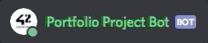

# 42-Wildcard
This project is for 42's Portfolio Project ("Wildcard") and this project is an open slate that allows us to create a program in a language of our choosing. I am choosing to make a Discord bot that will manage tedious tasks on my server, and add a new element of fun to it. The Portfolio Project Bot (PPB), is my own made bot over the course HackHighSchool and I will continue working on it for my own server and later optimized for other servers.

The purpose of making this bot was to handle tasks and make them easier as someone who helps run a discord server. By this I mean handling tasks such as deleting messages, adding roles to new members, and making sure the other commands I add to the bot can only be used by admins (if the command edits or manages the server). 

By doing this I spend less time  deleting messages, banning troublesome members, don't need to every worry about members not having proper permission because of autorole, and other micro-managing tasks.

Not only does it handle some more important roles, but it also add some spice to the server with funny commands, TTS, and a neat status-changing command that changes the bot's game played every X seconds.

This project started off as a great way to expand my knowledge of python and do something fun. As it turns out I will not stop working on this bot because it can never be perfect, and I have had so many great ideas of what I can do with it. The only trouble will be finding the time to implement it all 😅.

To get my bot in your server simply head to the following URL, invite, and enjoy!

https://discordbots.org/bot/520708933241798676
